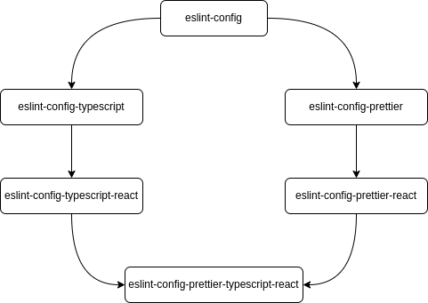

# Настройки ESLint/Prettier/TypeScript

## Многоуровневый ESLint

Многоуровневая структура правил ESLint. Некоторые правила применяются к проектам TypeScript. Некоторые для проектов
TypeScript + React.
Также можно добавить правила Prettier.



## Доступные скрипты

### Публикация пакетов

```bash
$ lerna publish
```

### Повторная публикация

```bash
$ lerna exec -- "npm publish || exit 0"
```

### Проверка кода

```bash
$ npm run lint
```
